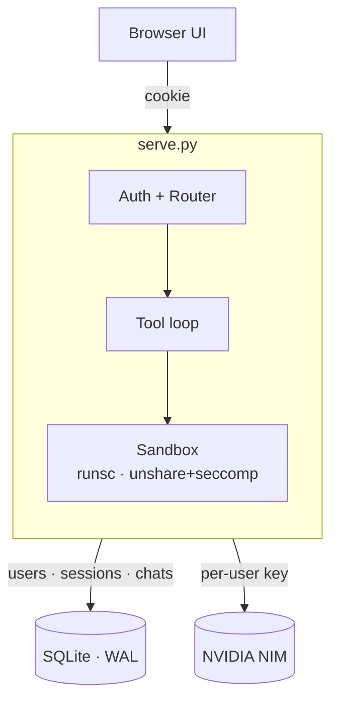

# NIMINI

A small, single-file NVIDIA NIM chat proxy with persistent multi-user
conversations, live translation, image generation, sandboxed Python execution,
embedding/rerank/OCR/molecular-design tools, and bring-your-own-key auth.

The whole server is one Python file (`serve.py`, stdlib + `requests` +
`cryptography` + optional `pypdf`). The whole frontend is one HTML file
(`nvidia_chatbot.html`). No build step, no framework, no node_modules.

## Why

NVIDIA's NIM endpoints are good — fast Llama-4 / DeepSeek-V4 inference with
generous free credits at [build.nvidia.com](https://build.nvidia.com) — but
their hosted UI is missing things you'd want for everyday use: a stored chat
history, multi-user accounts, your-own-key auth, model-aware routing,
recovery on transient 5xx, a tool ecosystem.

This is that frontend, in ~4.2k lines of Python and ~4.0k lines of HTML.

## Highlights

- **BYOK** (Bring Your Own Key). Each user supplies their own NVIDIA NIM key at
  registration. Server validates against NVIDIA before storing. Never exposes
  the key back to the client (only a masked tail). Per-user usage = per-user
  quotas, no shared bill.
- **Multi-user, sessions, scrypt-hashed passwords**, sliding 30-day cookie TTL.
  Optional registration-token gate for shared servers.
- **Model registry + capability-aware routing**. `/v1/route` classifies the
  message (general / reasoning / code / creative / vision) and picks a model
  by category × context-need × health.
- **Recovery recipes (claw)**. Rate-limit backoff, 5xx fallback chain,
  413 truncate-retry; full ledger in error response bodies, with an
  `X-Recovery-Steps` count surfaced as a header.
- **Tool calls**: `image_generate`, `image_edit` (FLUX/SDXL/Kontext on NIM),
  `embed_similarity`, `rerank`, `ocr`, `molmim_generate`, `web_search` (DDG),
  `github_fetch_file` / `github_list_files` (read public repos via
  raw.githubusercontent.com / GitHub Contents API),
  `code_execute` (sandboxed Python — see Security below), `math_eval`
  (SymPy), `tts` (local VibeVoice worker, optional).
- **Conversation compaction** — `/compact` slash command, plus automatic
  firing at 80% context. The entire history is summarized to a single
  entry; subsequent turns build on top of that summary plus new messages.
  Two budget modes: `rel N%` (target = N% of *current* tokens) and
  `fix N%` (target = N% of *model context*).
- **Browser frontend**: dark theme, KaTeX math, Markdown with code highlight,
  drag-drop file ingestion, image attachment, voice playback (when VibeVoice
  worker runs).

## Security

Three CVE families against modern Linux kernels (`CVE-2026-31431` Copy Fail,
`CVE-2026-43284` xfrm-ESP, `CVE-2026-43500` RxRPC) all rely on local code
execution to escalate. The `code_execute` tool defends against them with a
multi-layer sandbox:

| Layer | Mechanism | Coverage |
|---|---|---|
| Sandbox backend | gVisor (`runsc`) when installed; else Linux user/PID/IPC/net namespaces + seccomp BPF | Blocks the syscall path each CVE relies on |
| AF_ALG block | gVisor returns `EAFNOSUPPORT`; unshare backend installs a seccomp filter that returns `EACCES` for `socket(AF_ALG, ...)` | Closes Copy Fail entry from inside the sandbox |
| Module blacklist | `/etc/modprobe.d/cve-2026-dirtyfrag-copyfail.conf` keeps `esp4`/`esp6`/`rxrpc` from loading at all | Closes Dirty Frag entry on the *host* |
| Resource limits | RLIMIT_AS 1 GiB, CPU 60s, FSIZE 32 MiB, NPROC 32, no coredumps | Caps DoS surface |

See [`docs/SECURITY.md`](docs/SECURITY.md) for the full threat model.

## Architecture



## Quick start

### 1. Get the code
```bash
git clone https://github.com/<you>/nimini
cd nimini
```

### 2. Install runtime deps
```bash
pip install --user requests cryptography
pip install --user pypdf      # optional, for PDF text extraction
```

### 3. (Recommended) Install gVisor for stronger code_execute sandboxing
```bash
ARCH=$(uname -m)
URL="https://storage.googleapis.com/gvisor/releases/release/latest/${ARCH}"
curl -fsSL --remote-name-all "${URL}/runsc" "${URL}/runsc.sha512"
sha512sum -c runsc.sha512
sudo install -m 755 runsc /usr/local/bin/runsc
```
The server auto-detects `runsc` on startup and prefers it; otherwise falls back
to namespaces + seccomp.

### 4. (Recommended) Install kernel-CVE module blacklist
```bash
sudo cp docs/modprobe.d/cve-2026-dirtyfrag-copyfail.conf /etc/modprobe.d/
sudo sync && echo 3 | sudo tee /proc/sys/vm/drop_caches
```

### 5. Run
```bash
python3 serve.py                                # localhost:8765, open registration
python3 serve.py --host 0.0.0.0                 # LAN; auto-generated reg token
python3 serve.py --host 0.0.0.0 --open-registration   # LAN, no token gate
```

Open `http://localhost:8765/`. Register with username + password + your NVIDIA
NIM key (get one at [build.nvidia.com](https://build.nvidia.com)). The first
account becomes admin and inherits any pre-existing conversations.

## Optional: VibeVoice worker (local TTS)

VibeVoice-Realtime-0.5B runs as a separate process so the main proxy stays
small. Skip if you don't need synthesized speech — the chat falls back to the
browser's system TTS automatically.

```bash
pip install --user transformers torch accelerate vibevoice
python3 vibevoice_worker.py    # listens on :8766 by default
```

The proxy detects the worker via `VIBEVOICE_WORKER` env (default
`http://127.0.0.1:8766`) and exposes `/v1/tts`, `/v1/tts/voices`,
`/v1/tts/health`.

## License

MIT — see [LICENSE](LICENSE).
